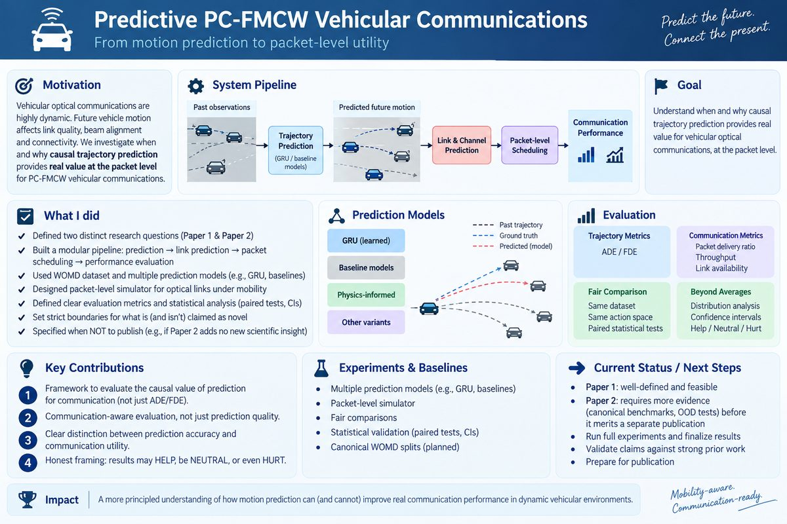

# Predictive PC-FMCW/DPSK Vehicular Communications

**Causal trajectory forecasting for deadline-aware optical vehicle scheduling**



**English** | [Ελληνικά](README_GR.md) · [Paper 1 / Paper 2 boundary](docs/PAPER_SCOPE_BOUNDARY.md) · [Paper roadmap](PAPER_ROADMAP.md) · [Executable stages](stages) · [Repository architecture](docs/REPOSITORY_ARCHITECTURE.md) · [Paper draft](paper/PAPER_DRAFT.md)

> Can motion forecasts help a vehicle scheduler deliver packets before a
> directional optical link disappears - and does lower trajectory error
> actually imply better communication performance?

This repository contains shared scientific infrastructure for **two distinct publication scopes**. The scopes are deliberately separated so that completed mechanism/scheduling evidence is not confused with the incomplete learned-model study.

## Publication scopes

### Paper 1 — mechanism and operating-region study

**Working title:** *When Does Trajectory Prediction Help PC-FMCW/DPSK Vehicular Optical Scheduling?*

Paper 1 asks **when and why causal future-motion information has packet-level scheduling value**. It covers the causal mobility-to-link-to-packet pipeline, classical predictors, reactive/predictive scheduling, link-lifetime versus packet urgency, HELP/NEUTRAL/HURT operating regions, utility/service-order diagnostics, current-service guarded prediction, prospective DEV/HOLDOUT evaluation, and the statistics/robustness required to support those claims.

**Paper 1 does not require the GRU/WOMD learned study to be complete.** Learned-model results must not be used to block or inflate Paper 1.

### Paper 2 — communication-aware learned trajectory prediction

**Working title:** *From Trajectory Accuracy to Communication Utility: Communication-Aware Learning for Predictive Vehicular Optical Scheduling*

Paper 2 asks **how a learned causal trajectory predictor should be trained when the downstream target is communication usefulness rather than geometric accuracy alone**. It covers the WOMD learned-data pipeline, GRU training, four communication-aware objectives, 4 objectives x 5 seeds = 20 verified checkpoints, untouched held-out/OOD evaluation, and trajectory -> link -> packet evaluation of the learned objectives.

**Paper 2 is not currently complete.** Its canonical WOMD/checkpoint evidence and official learned held-out/OOD results remain blocked/missing. It should become a separate publication only if the learned study produces a genuinely distinct scientific answer rather than merely adding a GRU row to Paper 1.

The authoritative scope boundary and repository labelling rules are in [`docs/PAPER_SCOPE_BOUNDARY.md`](docs/PAPER_SCOPE_BOUNDARY.md).

## Shared research questions and infrastructure

The shared system connects real/synthetic vehicle trajectories to a model-based PC-FMCW/DPSK optical link and a packet simulator with queues, deadlines, retries and fairness. It extends the supplied Part-A physical layer; it is **not** the separate joint beam/ADB project.

For Paper 1, the primary systems thesis is:

> **Determine when causal trajectory prediction has real packet-level
> communication value in PC-FMCW/DPSK vehicular optical scheduling, and whether
> geometric forecasting accuracy is a reliable proxy for downstream
> communication performance.**

The core Paper-1 research questions are:

1. **RQ1 — From trajectory accuracy to link accuracy:** Does lower ADE/FDE imply better prediction of the future optical link, including range/bearing, SNR, outage and link lifetime?
2. **RQ2 — From link accuracy to packet utility:** Does better future-link prediction actually improve packet-level outcomes such as goodput, PDR, latency, deadline satisfaction, queue behavior and fairness?
3. **RQ3 — Operating regions:** Under which mobility, prediction-horizon, traffic-load, deadline, FoV, sensing-noise and channel conditions does predictive scheduling help, become neutral or hurt relative to reactive scheduling?

Paper 2 adds a distinct learned-model question:

> **Can communication-aware GRU objectives improve the prediction-to-communication translation beyond trajectory-only learning?**

The shared mechanism chain is:

```text
causal vehicle history
        -> future trajectory prediction
        -> future relative range / bearing
        -> predicted optical-link state
        -> SNR -> BER -> PER -> outage / link lifetime
        -> queue- and deadline-aware scheduling
        -> packet outcome on the ground-truth-derived realized link
```

Ground-truth future motion is used only to realize and evaluate the link. A deployable predictor or scheduler never sees it.

## Canonical Stage 0-8 workflow

The legacy full-stack canonical workflow remains under `stages/`. It represents the complete combined research program and therefore includes learned stages that are required for Paper 2 but are not automatically prerequisites for Paper 1.

| Stage | Folder | Purpose | Publication relevance |
|---:|---|---|---|
| 0 | [`00_freeze_and_provenance`](stages/00_freeze_and_provenance) | Freeze protocol and split policy | SHARED |
| 1 | [`01_womd_data_pipeline`](stages/01_womd_data_pipeline) | Materialize/audit frozen WOMD corpora | PAPER2 |
| 2 | [`02_pc_fmcw_dpsk_link`](stages/02_pc_fmcw_dpsk_link) | Freeze the Part-A link mapping | SHARED |
| 3 | [`03_classical_baselines`](stages/03_classical_baselines) | Evaluate Last/CV/CA/Kalman/IMM | PAPER1 |
| 4 | [`04_communication_aware_gru`](stages/04_communication_aware_gru) | Select loss weights and train GRUs | PAPER2 |
| 5 | [`05_official_predictor_evaluation`](stages/05_official_predictor_evaluation) | Evaluate untouched learned validation | PAPER2 |
| 6 | [`06_packet_scheduling`](stages/06_packet_scheduling) | Run packet experiments | PAPER1 / PAPER2 depending manifest |
| 7 | [`07_statistics_and_figures`](stages/07_statistics_and_figures) | Analyze operating regions | PAPER1 / PAPER2 depending manifest |
| 8 | [`08_final_paper`](stages/08_final_paper) | Build release | scope-specific release required |

Reusable implementation remains under `src/predictive_pc_fmcw/`; paper folders must not duplicate scientific code.

## Evidence status

| Evidence | Scope | State |
|---|---|---|
| Trajectory -> link -> packet simulation | SHARED | Implemented and tested |
| Part-A receiver-derived LUT | SHARED | Executed on a 31-point SNR grid |
| Classical trajectory/link baselines | PAPER1 | Implemented; development evidence exists |
| Predictive scheduling/mechanism diagnostics | PAPER1 | Executed diagnostic evidence exists |
| Prospective current-service-guard DEV/HOLDOUT study | PAPER1 | Executed diagnostic/prospective evidence; final publication closure still required |
| Complete canonical Paper-1 statistical/artifact release | PAPER1 | Not complete |
| Historical WOMD training fingerprint | PAPER2 | Provenance fingerprint only |
| Complete four-objective x five-seed learned archive | PAPER2 | Missing / not complete |
| Official learned held-out/OOD evaluation | PAPER2 | Blocked until real data/checkpoints exist |
| Measured optical-channel validation | SHARED | Not available and not claimed |

## Repository labelling convention

Publication-facing work should be labelled as one of:

- `PAPER1` — mechanism/operating-region paper evidence;
- `PAPER2` — communication-aware learned paper evidence;
- `SHARED` — implementation or assumptions used by both;
- `HISTORICAL_DIAGNOSTIC` — exploratory evidence that is not a final publication result.

Code existence, CI success, or a development result does not by itself make an artifact publication evidence.

## Recommended publication-facing layout

```text
paper/
├── paper1/
│   ├── README.md
│   ├── manuscript/
│   ├── figures/
│   └── tables/
├── paper2/
│   ├── README.md
│   ├── manuscript/
│   ├── figures/
│   └── tables/
└── shared/

artifacts/
├── paper1_final/
├── paper2_final/
├── shared/
└── diagnostics/
```

This is the target publication-facing separation. Existing legacy artifacts are not silently reclassified; they require an explicit manifest before becoming final Paper 1 or Paper 2 evidence.

## Installation and verification

```bash
sudo apt update
sudo apt install -y python3 python3-venv python3-pip build-essential
python3 -m venv .venv
source .venv/bin/activate
python -m pip install --upgrade pip
pip install -e ".[dev,ml,paper]"

make test
make lint
make validate
```

PyTorch is needed only for learned-model stages.

## Repository layout

```text
stages/                        legacy combined Stage 0-8 orchestration/contracts
src/predictive_pc_fmcw/        shared reusable scientific/software library
scripts/                       canonical and auxiliary executable entrypoints
configs/                       frozen physical/experimental assumptions
tests/                         regression and scientific gates
artifacts/                     final and diagnostic evidence; scope manifest required
paper/                         publication-facing manuscript material
docs/PAPER_SCOPE_BOUNDARY.md   authoritative Paper 1 / Paper 2 boundary
notebooks/                     GPU/data-acquisition operator workflows
```

## One-line distinction

**Paper 1 asks when and why prediction has packet-level scheduling value; Paper 2 asks how a learned predictor should be trained for downstream communication usefulness.**
